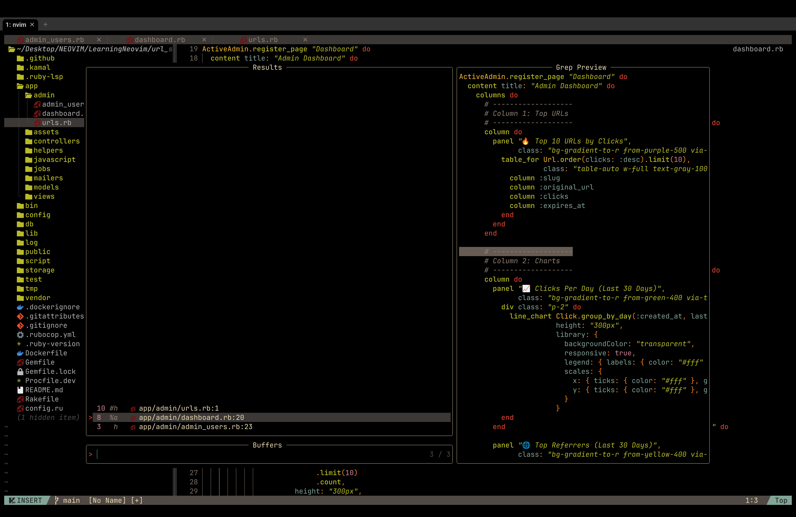

# Nvim Kickstart Config

This repo contains my custom Neovim config, built on top of [kickstart.nvim](https://github.com/nvim-lua/kickstart.nvim). It's designed to provide a clean, modern setup with LSP support, autocomplete, formatting, and everything else you'd expect from a serious Neovim setup.

Works with neovim v0.11.5 and above.




## File Structure

```text
├── LICENSE
├── NeoVim.png
├── nvim
│   ├── init.lua
│   ├── lazy-lock.json
│   └── lua
│       ├── core
│       │   ├── keymaps.lua
│       │   ├── options.lua
│       │   └── snippets.lua
│       └── plugins
│           ├── alpha.lua
│           ├── autocompletion.lua
│           ├── autoformatting.lua
│           ├── bufferline.lua
│           ├── colortheme.lua
│           ├── debug.lua
│           ├── enhancements.lua
│           ├── gitsigns.lua
│           ├── indent-blankline.lua
│           ├── lazygit.lua
│           ├── lsp.lua
│           ├── lualine.lua
│           ├── misc.lua
│           ├── neotree.lua
│           ├── statusline.lua
│           ├── telescope.lua
│           └── treesitter.lua
└── README.md
```
